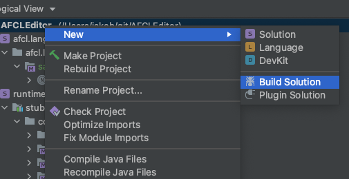
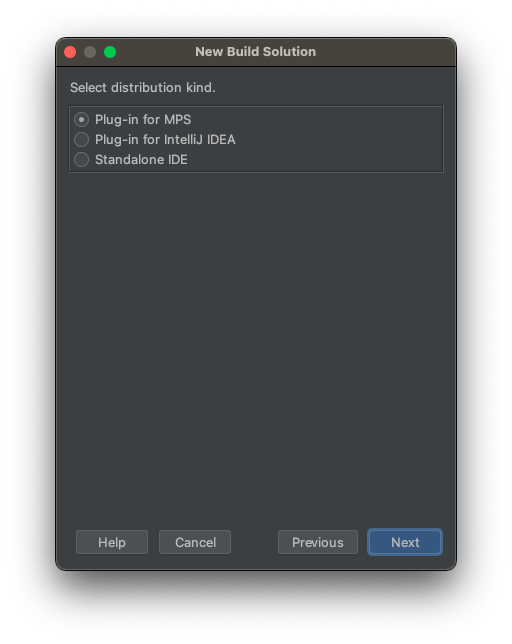
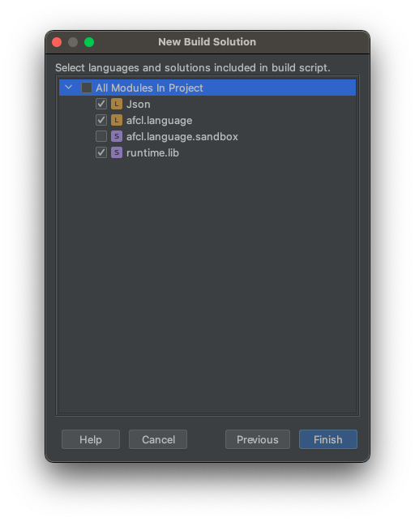
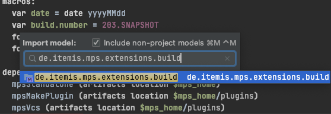
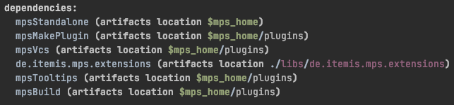
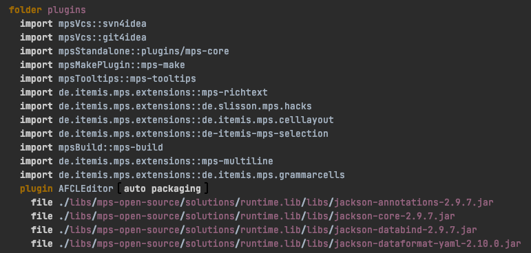
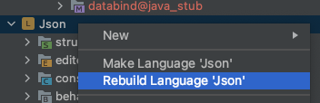
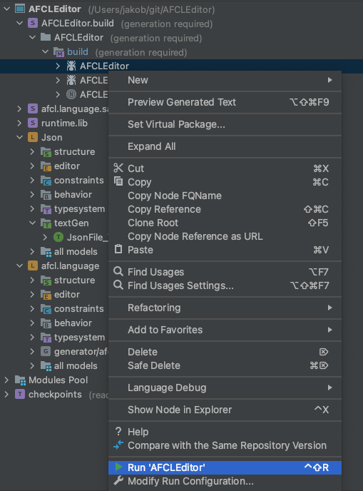

# Building process for standalone AFCL editor

## Global settings to make the IDE build

For a working build process it is necessary to download the [generic distribution](https://www.jetbrains.com/mps/download/#section=zip) for MPS, since the distributions targeting a single platform (MacOS, Linux or Windows) would miss artifacts needed by the other platforms. You need to set the **mps_home** path variable inside your main MPS application to the location of the generic MPS download. This can be done inside the **Settings/Prefereences** of MPS under **Apperance & Behavior -> Path Variables**

## Generation of new build script

By changing dependencies within the MPS project it can sometimes happen, that the regeneration of the build script, which is a script for generating a standalone editor, is necessary. Normally this can be skipped and you can proceed with the [following section](#building-without-generation-of-new-build-script).

### Build Solution Wizard

To create a build script from scratch you can use the **Build Solution Wizard**. For that you right click on the project and select **New -> Build Solution**:

Follow the wizard and select Standalone IDE and select all languages and solutions, except for the sandbox:

### Fixing dependencies

Since our language relies on the package **grammarcells** and some other packages, we need to add them to the dependencies. For that you use the hotkey **ctrl + m** two times and search for *de.itemis.mps.extensions.build* and import it:

After that you are able to add all necessary dependencies to the dependencies section of the build script as shown below. It has to be noted that a simple copy paste approach doesn't work within the build script and thus you need to make those changes by hand.

You additionally also need to add the following entries to the plugins section:

After reloading the modules from the disk with **Alt/Options + Enter** the IDE should build.

## Building without generation of new build script

After fixing the global settings we can finally start the build process:

1. Right click on **Json** in the project tool window and click on **Rebuild Language 'Json'**.

2. Right click on **afcl.language** in the project tool window and click on **Rebuild Language 'afcl.language'**.

3. Right click on the the **AFCLEditor** in the project tool window and click on **Run 'AFCLEditor'**.
    * if there are any errors during the execution of this script, they can usually be fixed by pressing **Alt/Options + Enter** and clicking on **Reload Modules From Disk** within the script file.

4. Right click on the the **AFCLEditorDistribution** in the project tool window and click on **Run 'AFCLEditorDistribution'**.

5. After the execution has finished you can find the Standalone IDE for Windows, Linux and MacOS in **build/artifacts/AFCLEditorDistribution** within the root folder of the MPS project

## Adding JBR to Application

After you have build the IDE for all platforms, you should add **jbr** to all applications, which can be taken from the platform dependent MPS version. This allows the application to be started without the need for a specific Java Runtime Environment.
