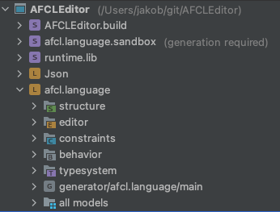

# Project Structure

The Project is subdivided into following modules:

* `AFCLEditor.build` contains the build script to export the AFCL DSL to a standalone IDE.

* `afcl.language.sandbox` contains a sandbox for testing the AFCL language for development purposes.

* `runtime.lib` contains a couple of Java libraries, which are needed by the Json Language.

* `Json` is the definition of the JSON language, which was taken from [MPS Open Source](https://github.com/dslmeinte/mps-open-source). It gets used by the AFCL language to export the Workflow to the original YAML representation.

* `afcl.language` is the definition of the AFCL DSL. It is subdivided into:
    * `structure` describes the nodes and structure of the language AST.
    * `editor` describes how a language will be presented and edited in the editor
    * `constraints` describes the constraints on AST: where a node is applicable, which property and reference are allowed, etc.
    * `behavior` describes the behavioral aspect of AST, and thus extend the nodes with more functionality.
    * `typesystem` describes the rules for calculating types in a language
    * `generator` describes a mapping rule to a different language. In our case, that would be the mapping from the AFCL DSL to the Json language.

## MPS Tutorial

To get started with MPS the tutorial of [HeayMeta.tv](https://heavymeta.tv/) is recommended. It gives a lot of background information on language design and it was the main information source for this project.
