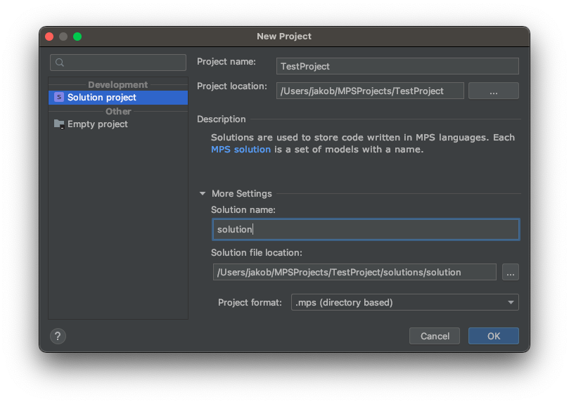
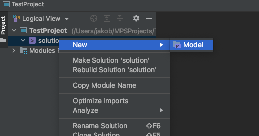
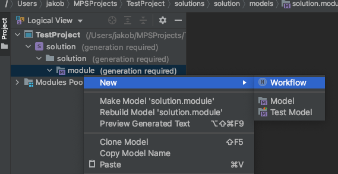
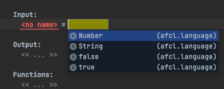
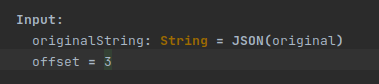
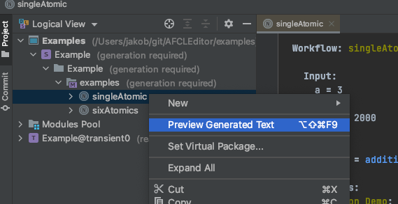

# Tutorial

This tutorial describes how you can use the standalone version of the AFCL editor to conveniently generate workflow descriptions in [AFCL format](https://apollowf.github.io/learn.html) which can be directly used as input for the [Apollo runtime system](https://github.com/Apollo-Core).

## Setting up and launching the editor

1. You can download the standalone IDE for Linux, macOS and Windows from [here](https://github.com/Apollo-AFCL/AFCLEditor/releases/tag/V1.0.0).
2. Unzip the downloaded file to a directory.
3. Open the editor directory and navigate to the `./bin` folder.
4. Run the command `./afcleditor.sh` to launch the editor.

## Creating a new AFCL project and a workflow file

1. Launch the AFCL Editor (See previous section).
    * If the Welcome screen opens, click **New Project**.
    * Otherwise, from the main menu, select **File -> New Project**.
2. In the New Project wizard you can give your project and solution a name:

3. Click OK.
4. In the project tool window right click on your solution and create a module:

5. You need to add the AFCL language to the module:

6. After that you are can create a workflow within this module by clicking `New -> Workflow`:

## Working with the editor

There are a few things to note when using the editor to define workflows:

- Ideally, you should define the workflow components (functions and compounds) in the order of the data flow (top to bottom in the AFCL file), so that you can reference the outputs of functions higher in the file (producers) as the inputs of the functions defined later (consumers)
- Note that the syntax used in the editor does not fully correspond to the terms used in the AFCL language (particulary when defining the workflow input - see explanation below)
- The intended working mode of the editor is that you define the workflow components mainly by using its auto-complete feature (see picture below). Free typing is necessary only when defining names/IDs, so make sure to first checking which options the editor auto-complete offers for an entry before attempting to directly enter text
- Be cautios about copy-pasting code, since it may distort the format and be difficult to correct  

### Example usage of the auto-complete feature (**CTRL+Space**):

### Defining the workflow input

The "**Input:**" entry is used to define:

- Constants which are available to all functions of the workflow, defined as `[constantName] = [dataType]`
- Input variables which are read from the JSON file specifying the workflow input at runtime, defined as `[variableName]:[dataType]=JSON([jsonKey])`

The following example illustrates a definition of two workflow inputs:

- `originalString` - A string variable which will be read from the JSON file provided as input at runtime, where it will be stored under the key "original"
- `offset` - A constant number with a value of 3 (Created by (a) entering the input name, (b) hitting **CTRL+Space** to show the available data types, (c) selecting "Number", and (d) entering the value 3)

## Generating the worflows description in AFCL format

After defining the workflow in the editor, you can create a workflow file in AFCL format by right clicking on the workflow in the editor and selecting **Preview Generated Text**:

The contents of the preview can then be copied into a `.yaml` file and used to specify the workflow of the underlying application when enacting the application with the Apollo runtime system.
