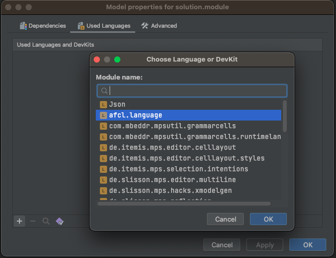

# Tutorial

You can download the standalone IDE for Linux, macOS and Windows from [here](https://github.com/Apollo-AFCL/AFCLEditor/releases).

## Create a new AFCL project

1. Launch the AFCL Editor.
    * If the Welcome screen opens, click **New Project**.
    * Otherwise, from the main menu, select **File -> New Project**.
2. In the New Project wizard you can give your project and solution a name:

3. Click OK.
4. In the project tool window right click on your solution and create a module:

5. You need to add the AFCL language to the module:

6. After that you are able to create your first workflow within this module:

7. You can use **CTRL+Space** to get some suggestions from the IDE:

## Export as YAML

To generate a YAML file from the workflow right click on it and select **Preview Generated Text**:

